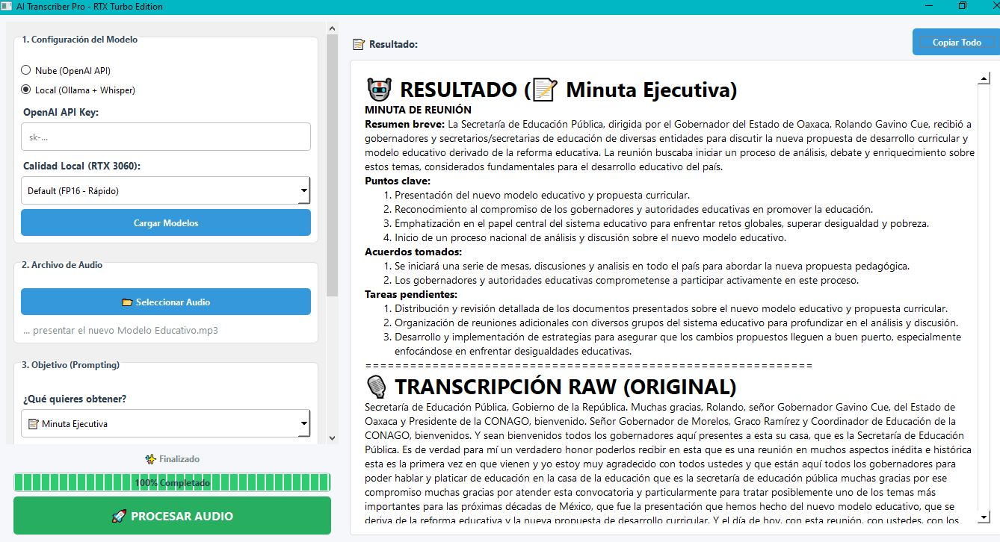

# 🎙️ AI Transcriber Pro: Local & Cloud Power


-purple)


Una suite de productividad de escritorio para transformar audio en conocimiento estructurado. Diseñada con una arquitectura híbrida que permite al usuario elegir entre la potencia de la nube (**OpenAI**) o la privacidad total de la ejecución local (**Ollama + Whisper Local**).



---

## 🌟 Características Clave

* **Arquitectura Híbrida:**
    * ☁️ **Modo Nube:** Utiliza la API de OpenAI (Whisper + GPT-4) para máxima precisión y velocidad sin requerir hardware potente.
    * 🏠 **Modo Local (Privacidad Total):** Ejecuta **Whisper Large-v3** y modelos de **Ollama** (como Llama 3 o Qwen) directamente en tu GPU. ¡Tus datos nunca salen de tu PC!
* **Ingeniería de Prompts Integrada:**
    * 📝 **Minutas Ejecutivas:** Resúmenes automáticos con acuerdos y tareas.
    * 🦜 **Transcripción Literal:** Fiel palabra por palabra.
    * 🧹 **Limpieza de Texto:** Elimina muletillas y corrige gramática.
    * 🔍 **Extracción de Datos:** Saca fechas, nombres y lugares en lista.
* **Optimización de Hardware:** Soporte para cuantización en **4-bit y 8-bit** para correr modelos pesados en GPUs de consumo (ej. RTX 3060).

---

## 🛠️ Instalación

1.  **Clonar el repositorio:**
    ```bash
    git clone [https://github.com/raulcamaracarreon/AI-Transcriber-Pro.git](https://github.com/raulcamaracarreon/AI-Transcriber-Pro.git)
    cd AI-Transcriber-Pro
    ```

2.  **Instalar dependencias:**
    ```bash
    pip install -r requirements.txt
    ```

3.  **(Solo para Modo Local) Instalar Ollama:**
    * Descarga e instala [Ollama](https://ollama.com/).
    * Descarga el modelo recomendado:
        ```bash
        ollama pull qwen2.5-coder:14b
        ```

4.  **Ejecutar:**
    ```bash
    python main.py
    ```

---

## ⚙️ Configuración de Modelos Locales

Si deseas usar el **Modo Local**, asegúrate de editar la variable `LOCAL_LLAMA_MODEL` en el archivo `main.py` si prefieres usar otro modelo que ya tengas descargado en Ollama (por ejemplo `llama3` o `mistral`).

```python
# En main.py
LOCAL_LLAMA_MODEL = "qwen2.5-coder:14b"  # Cambia esto por tu modelo favorito

 ```

### Autor: Raúl Héctor Cámara Carreón

Herramienta desarrollada para optimizar flujos de trabajo de análisis cualitativo y documentación.
